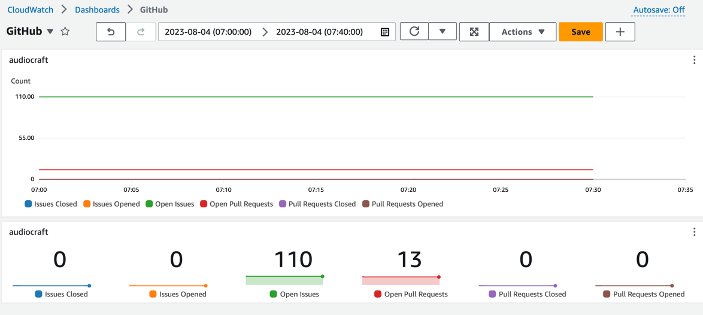

# GitHub Repo Stats to CloudWatch

## Features

This application will fetch stats of a configurable set of GitHub repositories,
based on a configurable time interval. It will then upload them to Amazon
CloudWatch.

The full list of fetched stats per repository can be found [below](#accessing-published-metrics).

You can then use these metrics to create a CloudWatch Dashboard to monitor the
health across your GitHub repositories.



## Prerequisites

### Install Java and Maven

Install Java 11 and Maven

```shell
brew install openjdk@11 maven
```

### Verify permissions

Check that the IAM user you want to use has the `cloudwatch:PutMetricData`
permission.

### Optional. Obtain a personal GitHub Token

Since GitHub's API limit is very low, this is recommended. The process of
obtaining one is quite
quick. https://docs.github.com/en/authentication/keeping-your-account-and-data-secure/managing-your-personal-access-tokens#creating-a-fine-grained-personal-access-token

## Getting Started

Clone the repository.

```shell
git clone https://github.com/sirknightj/github-stats-cloudwatch.git
```

### Configuring the application

#### Which GitHub Repositories to fetch

In [Main.java](src/main/java/com/sirknightj/Main.java), update the list of repositories
to pull from. The keys are the repository owner, and the values are the
repository name.
For example:

```java
final List<Map.Entry<String, String>> reposToFetch = List.of(
      Map.entry("facebookresearch","audiocraft"),
      Map.entry("facebookresearch","llama")
);
```

The above configuration will fetch the stats
of https://github.com/facebookresearch/audiocraft
and https://github.com/facebookresearch/llama.

#### Other configuration options

You will need to update the region
in [GitHubStatsCloudWatchPublisher.java](src/main/java/com/sirknightj/cloudwatch/GitHubStatsCloudWatchPublisher.java#L37)
to the region you want to upload the stats to.
Optionally, you can configure the daily offset at which the stats are fetched,
and the timezone in [Main.java](src/main/java/com/sirknightj/Main.java).

#### Provide AWS Credentials

The CloudWatch client used in this application uses the default credentials
provider
chain: https://docs.aws.amazon.com/sdk-for-java/latest/developer-guide/credentials-chain.html

You can provide aws credentials using
the [AWS CLI](https://docs.aws.amazon.com/cli/latest/userguide/getting-started-install.html#getting-started-install-instructions)
. `aws configure`.

### Compiling

To compile, change directories to the directory containing [pom.xml](pom.xml).

```shell
cd github-stats-cloudwatch
```

Then, run the following maven command:

```shell
mvn clean compile assembly:single
```

This will create a `.jar` in the folder `target/`.

### Run

Optional. Provide your GitHub Token as an environment variable:

```shell
export GITHUB_TOKEN=<YourToken>
```

To run the `.jar`, use the following command:

```shell
java -jar /path/to/file.jar
```

To run this as a background task (for example, let this run in an EC2 and log off), you can use `nohup`:
```shell
nohup java -jar /path/to/file.jar &
```

## Accessing published metrics

This application publishes metrics under the **GitHub Stats** custom namespace.

1. Sign in to the AWS Management Console and open the CloudWatch console
   at https://console.aws.amazon.com/cloudwatch/.

2. In the left navigation, under **Metrics**, select **All Metrics**.

3. Choose the **Browse** tab, then select the **GitHub Stats** custom namespace.

The following metrics are available. These are sorted by **Stat** in alphabetical
order:

| Dimensions | Stat                 | Description                                             |
| ---------- |----------------------|---------------------------------------------------------|
| Owner, Repository | Issues Closed        | The number of issues closed within the past _interval_. |
| Owner, Repository | Issues Opened        | The number of issues closed within the past _interval_.  |
| Owner, Repository | Open Issues          | The number of issues currently open.                    |
| Owner, Repository | Open Pull Requests   | The number of pull requests currently open.             |
| Owner, Repository | Pull Requests Closed | The number of pull requests closed within the past _interval_.  |
| Owner, Repository | Pull Requests Opened | The number of pull requests opened within the past _interval_. |

The default interval is 24 hours. You can configure that in the [FetchGitHubStatsOncePerDayApplication](src/main/java/com/sirknightj/application/FetchGithubStatsOncePerDayApplication.java). Note that the application may not behave correctly if the interval is more than 24 hours, so use that at your own risk.

**Note**: "issue" here refers to _only_ issues. This does **not** including pull
requests. [GitHub API makes this confusing](https://docs.github.com/en/rest/issues/issues?apiVersion=2022-11-28#list-issues-assigned-to-the-authenticated-user).

For a detailed guide on how to add these metrics to a CloudWatch dashboard, check out the CloudWatch documentation [here](https://docs.aws.amazon.com/AmazonCloudWatch/latest/monitoring/create_dashboard.html).

## Contributing

⭐ Star this repository!

Pull requests are welcome.

## Issues and Bug Reports

To submit an issue or bug, please open an issue.
